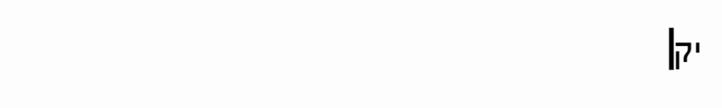

# Language Flipper

> **Fix text typed in the *wrong* keyboard layout with a single hot-key.**  
> Select → hit <kbd>Ctrl</kbd> + <kbd>M</kbd> (default) → watch gibberish turn into the text you *meant* to write — and keep on typing in the correct layout.
```
פ  פ  ש     צ  ט      ע  מ  נ  ד  ו      ר  ם  ע      ד  ל  מ  ש  י  א
|  |  |  |  |  |     |  |  |     |  |  |  |  |     |  |     |  |  |
t  h  a  n  k  s     f  o  r     u  s  i  n  g     m  y     a  p  p
```
 <!-- Replace with a real GIF once recorded -->

---

## Table of Contents
1. [Why?](#why)
2. [Features](#features)
3. [Quick Start](#quick-start)
4. [Configuration](#configuration)
5. [Usage](#usage)
6. [How It Works](#how-it-works)
7. [Roadmap](#roadmap)
8. [Contributing](#contributing)
9. [License](#license)

---

## Why?

Ever discovered you’ve written half an email in gibberish instead of your desired language?  
Switching layouts, re-typing, or copy-pasting into online converters breaks your flow.  
**Language Flipper** lives in the background: one hot-key and the garbage text is replaced *in-place* with its correct-layout twin.

---

## Features

| ⚡️ | Fast — sub-100 ms round-trip |
|----|-----------------------------|
| 🎚️ | **Fully configurable**: pick any two layouts, map any characters, choose your own hot-key |
| 🕶️ | Runs silent — a single **statically-linked `.exe`** (no DLLs, no installer) |
| 🔄 | *Auto-flip* option: after correction, it switches Windows to the right layout so you can keep typing |
| 🪄 | Corrects **any app that accepts keyboard input** — editors, terminals, chat, you name it |

---

## Quick Start

1. **Download the latest release** from the **Releases** page.  
2. Double-click `language_flipper.exe`.  
3. Select some wrong-layout text and press **Ctrl + M**.  
4. 🌟 *Magic!* 🌟

---

## Configuration

All runtime options live in **[`config.h`](./config.h)**.

| Setting | Purpose | Default |
|---------|---------|---------|
| `DEBUG_MODE` | `true` ⇒ keep a console window with logs | `false` |
| `LANG_PRIMARY / SUBLANG_PRIMARY` | The layout you *accidentally* type in | English (US) |
| `LANG_SECONDARY / SUBLANG_SECONDARY` | The layout you *want* | Hebrew |
| `KEYMAP` | `std::unordered_map<wchar_t, wchar_t>` mapping characters between layouts | English ↔ Hebrew letters |
| `HOTKEY_MODIFIERS` / `HOTKEY_VK` | Global shortcut (see `<windows.h>` `MOD_…` flags) | `Ctrl + M` |
| `AUTO_FLIP_ON_CHANGE` | Flip Windows layout after correction | `true` |

### Changing the Key Map

Open `config.h`, locate the `KEYMAP` block, and edit/add pairs:

```
const std::unordered_map<wchar_t, wchar_t> KEYMAP = {
    // English → Hebrew
    {L'a', L'ש'},   // a → ש
    ...
};
```

Re-build; no other files need touching.

---

## Usage

1. Start the program (it hides itself unless `DEBUG_MODE` is `true`).  
2. **Select** any text that looks like garbage.  
3. Press your **hot-key** (default *Ctrl + M*).  
4. The junk text is instantly replaced with the correct letters.  
   If `AUTO_FLIP_ON_CHANGE` is enabled, your system layout also switches so you can keep typing.

> **Tip:** Works everywhere: VS Code, Word, Chrome address bar, Discord, even the Windows *Run* dialog!

---

## How It Works

1. Registers a global hot-key via `RegisterHotKey`.  
2. On trigger:  
   * Simulates **Ctrl + C** to copy the selection.  
   * Detects the active thread’s keyboard layout with `GetKeyboardLayout`.  
   * Transforms clipboard text by walking the `KEYMAP`.  
   * Types the corrected text back using `SendInput`.  
   * Optionally flips the layout with `LoadKeyboardLayout` + `ActivateKeyboardLayout`.

All logic fits in ~300 lines across `main.cpp`, `utils.cpp/h`, and `config.h`.

---

## Roadmap

- [ ] Record a demo GIF  
- [ ] Per-application enable/disable list  
- [ ] Auto-update mechanism  
- [ ] GUI configurator (edit `config.h` visually, regenerate + recompile)

---

## Contributing

Got an idea? Open an **issue**!

---

## License

**MIT** — see `LICENSE` for full text.  
Do what you want, but an attribution is appreciated. ❤️

